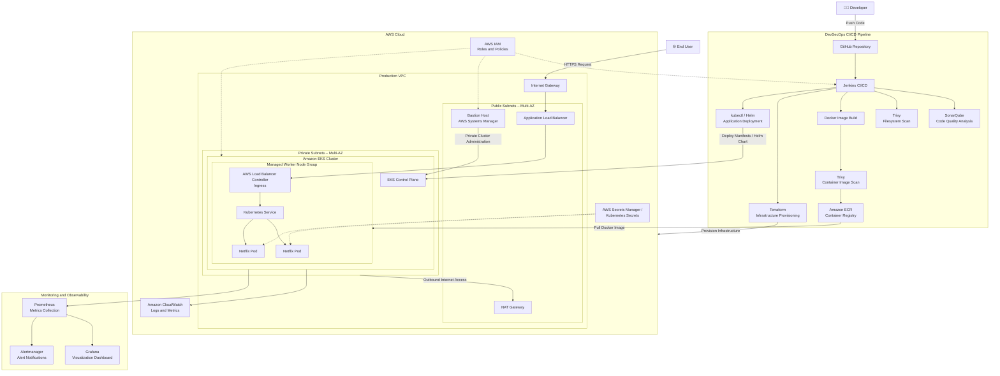

# Netflix Clone on AWS EKS with DevSecOps Pipeline

This project demonstrates an end-to-end DevSecOps pipeline using:

- GitHub
- Docker
- Jenkins / GitHub Actions
- SonarQube
- Trivy
- AWS ECR
- Terraform
- AWS EKS
- Helm
- ArgoCD
- Prometheus
- Grafana

## 🏗️ System Architecture

## 🔄 Architecture Workflow

1. The developer pushes application or infrastructure code to the GitHub repository.
2. GitHub triggers the Jenkins CI/CD pipeline.
3. SonarQube performs static code analysis and applies the configured quality gate.
4. Trivy scans the source code, dependencies, filesystem, and Docker image for vulnerabilities.
5. Jenkins builds the Netflix application Docker image and pushes it to Amazon ECR.
6. Terraform provisions the AWS VPC, public and private subnets, NAT Gateway, IAM roles, bastion host, and Amazon EKS cluster.
7. Jenkins deploys the application to EKS using Kubernetes manifests or Helm.
8. EKS worker nodes pull the approved container image from Amazon ECR.
9. External traffic enters through the Application Load Balancer and is routed to the Kubernetes Ingress, Service, and application Pods.
10. Prometheus collects application and cluster metrics, while Grafana provides monitoring dashboards and Alertmanager handles alerts.

## 🔐 Security Design

* EKS worker nodes run inside private subnets and are not directly accessible from the internet.
* The Application Load Balancer is the controlled public entry point for application traffic.
* The bastion host is accessed through AWS Systems Manager Session Manager, removing the need to expose SSH port `22`.
* IAM roles and policies follow the principle of least privilege.
* SonarQube and Trivy provide code-quality, dependency, filesystem, and container-image security checks.
* Sensitive configuration is stored using AWS Secrets Manager or Kubernetes Secrets instead of being committed to GitHub.
* Container images are stored securely in private Amazon ECR repositories.
* Amazon CloudWatch, Prometheus, Grafana, and Alertmanager provide centralized monitoring, logging, and alerting.
* Multi-AZ public and private subnets improve availability and fault tolerance.
